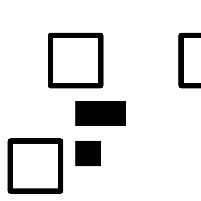
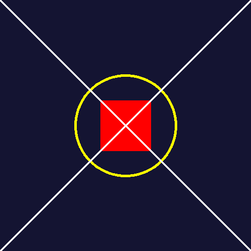
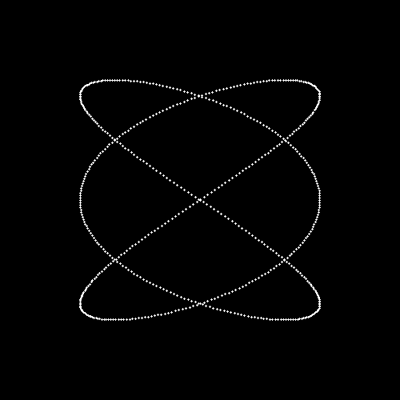

# Reporte de Misión: Graficación Táctica
**Agente Especial:** Arles Aguilar

---

## Evidencias de Misión

### Misión 1: El Mensaje Subexpuesto
**Código utilizado:**
```python
# --- MODO RAW ---
h, w = img1.shape
img1_raw = np.zeros((h, w), dtype=np.uint8)
for y in range(h):
    for x in range(w):
        img1_raw[y, x] = np.clip(img1[y, x] * 50, 0, 255)

# --- MODO OPENCV ---
img1_cv = cv2.multiply(img1, 50)
cv2.imwrite('m1_recuperada.png', img1_cv)
```
**Resultado:**


### Misión 2: El QR Fragmentado
**Código utilizado:**
```python
# 1. Crea lienzo de 400x400
lienzo_qr = np.zeros((400, 400, 3), dtype=np.uint8)

# 2. Traslada la mitad 1 y pégala
M1 = np.float32([[1, 0, 0], [0, 1, 0]])
res1 = cv2.warpAffine(mitad1, M1, (400, 400))

# 3. Rota la mitad 2, trasládala y pégala
h2, w2 = mitad2.shape[:2]
M2 = cv2.getRotationMatrix2D((w2 // 2, h2 // 2), 180, 1.0)
M2[1, 2] += (400 - h2) 
res2 = cv2.warpAffine(mitad2, M2, (400, 400))

# Unir
qr_completo = cv2.bitwise_or(res1, res2)
cv2.imwrite('m2_qr_reparado.png', qr_completo)
```
**Resultado:**


### Misión 3: El Sello Biométrico
**Código utilizado:**
```python
# 1. Crea el lienzo con color base
sello = np.zeros((500, 500, 3), dtype=np.uint8)
sello[:] = (50, 20, 20)

# 2. Dibuja círculo, rectángulo y líneas en ese orden exacto.
cv2.circle(sello, (250, 250), 100, (0, 255, 255), 3)
cv2.rectangle(sello, (200, 200), (300, 300), (0, 0, 255), -1)
cv2.line(sello, (0, 0), (500, 500), (255, 255, 255), 2)
cv2.line(sello, (500, 0), (0, 500), (255, 255, 255), 2)

cv2.imwrite('m3_sello_forjado.png', sello)
```
**Resultado:**


### Misión 4: La Frecuencia Térmica
**Código utilizado:**
```python
# 1. Convertir a HSV
hsv = cv2.cvtColor(img4, cv2.COLOR_BGR2HSV)

# 2. Crear máscara con cv2.inRange
lower_cyan = np.array([80, 100, 100])
upper_cyan = np.array([100, 255, 255])
mascara_cyan = cv2.inRange(hsv, lower_cyan, upper_cyan)

# 3. Guardar/Mostrar la máscara para leer la clave
cv2.imwrite('m4_clave_revelada.png', mascara_cyan)
```
**Resultado:**


### Misión 5: La Antena Parabólica
**Código utilizado:**
```python
# 1. Crea lienzo 500x500
lienzo_antena = np.zeros((500, 500, 3), dtype=np.uint8)

# 2. Bucle para t de 0 a 6.28 con incrementos de 0.01
t = 0.0
while t <= 6.28:
    # 3. Calcula x e y, redondéalos a int
    x = int(250 + 150 * math.sin(3 * t))
    y = int(250 + 150 * math.sin(2 * t))
    
    # 4. Usa cv2.circle(lienzo, (x, y), 1, (255, 255, 255), -1) para pintar el punto
    cv2.circle(lienzo_antena, (x, y), 1, (255, 255, 255), -1)
    t += 0.01

cv2.imwrite('m5_antena.png', lienzo_antena)
```
**Resultado:**


---

## Análisis del Analista (Reflexiones Finales)

1. **Sobre los Operadores Puntuales (Misión 1):** Matemáticamente, ¿qué pasaría si en lugar de multiplicar por 50, hubieras sumado 50 a cada píxel oscuro? ¿Se revela igual el mensaje?
> **Respuesta:** No, el mensaje no se revelaría correctamente. Al sumar 50, los valores que estaban entre 1 y 5 pasarían a estar entre 51 y 55. Aunque la imagen sería ligeramente más gris, la diferencia de contraste seguiría siendo de apenas 4 o 5 valores. Al multiplicar por 50, los valores se expanden a un rango de (50 a 250), estirando el contraste y haciendo que las letras destaquen fuertemente contra el fondo.

2. **Sobre el Espacio HSV (Misión 4):** ¿Por qué el modelo de color BGR es ineficiente para la Recuperación de Información cuando buscamos "todos los tonos de azul" (Cyan)?
> **Respuesta:** El modelo BGR acopla la información del color con la iluminación. Esto significa que un "cyan oscuro" y un "cyan brillante" tienen valores radicalmente distintos en sus canales, lo que hace muy difícil definir un límite simple con sentencias condicionales. El modelo HSV separa el Matiz (Hue) de la luz. En HSV, todo el cyan vive en un mismo rango de Matiz, independientemente de la sombra o brillo, facilitando la creación de máscaras lógicas.

3. **Sobre Ecuaciones Paramétricas (Misión 5):** ¿Por qué las ecuaciones paramétricas (usando el parámetro t) son mejores para dibujar formas cerradas y complejas que las funciones estándar (y = f(x))?
> **Respuesta:** Las funciones matemáticas estándar y = f(x) tienen una limitación estricta impuesta por la prueba de la línea vertical: para un valor de x, solo puede existir un único valor de y. Esto hace imposible dibujar curvas cerradas o figuras que se intersectan a sí mismas. Las ecuaciones paramétricas resuelven esto poniendo x e y en función de una tercera variable independiente (t). Esto le da a la curva la libertad de regresar sobre sus propios valores de x y crear formas cerradas.