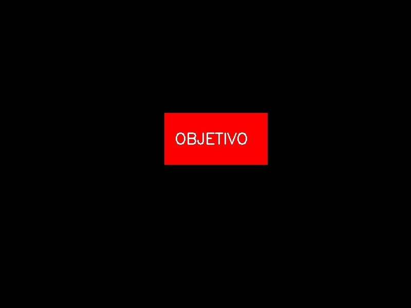
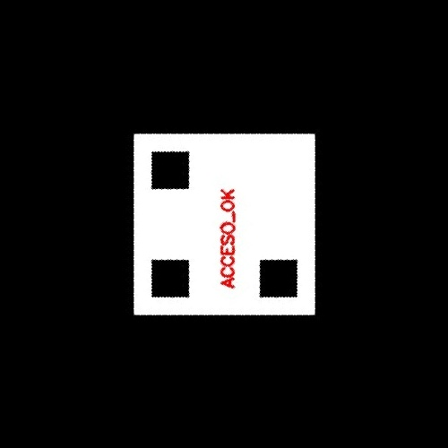
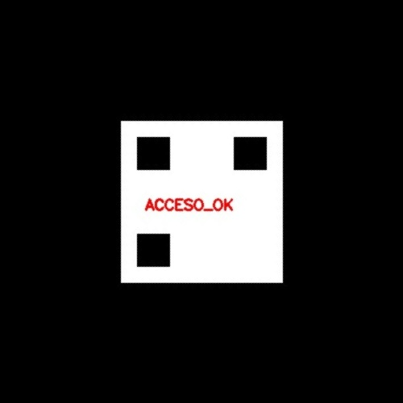
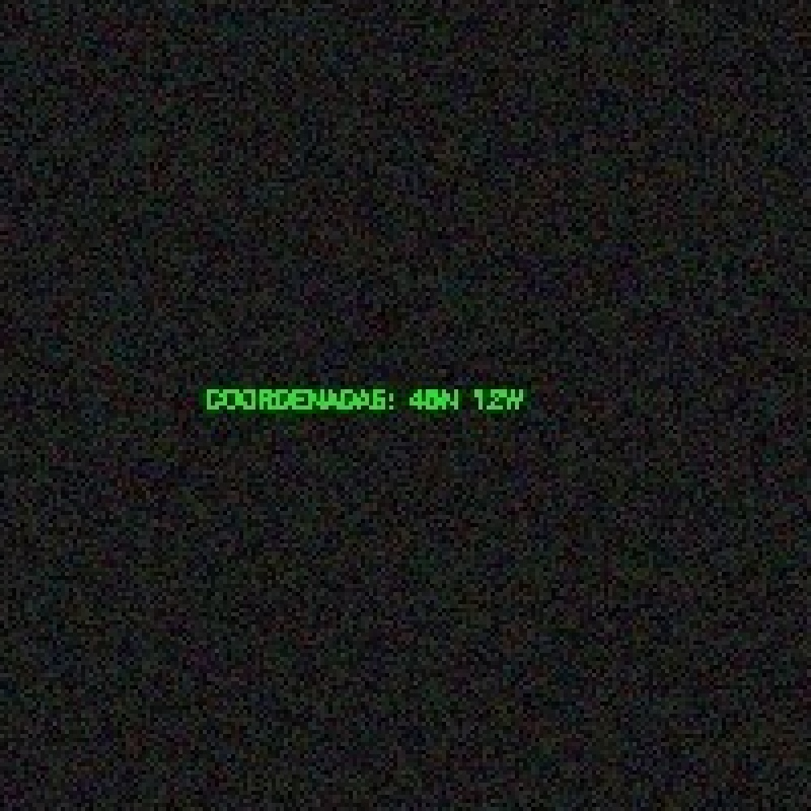
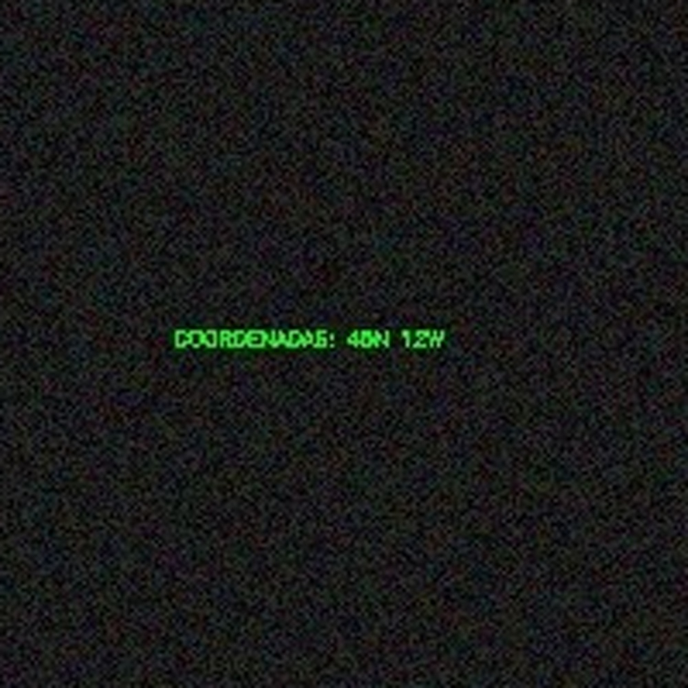

# Reporte Oficial de Misiones de Transformación de Imágenes

**Nombre:** Arles  
**Grupo:** B  
**Institución:** TECNM  
**Carrera:** Ingeniería en Sistemas Computacionales  
**Materia:** Graficación  

---

## Objetivo de la Práctica
Comprender y aplicar los principios matemáticos detrás de las transformaciones afines de imágenes (traslación, rotación y escalamiento) mediante la manipulación directa de matrices de píxeles (Modo Raw), y contrastar su eficiencia matemática y resultados visuales contra las funciones optimizadas de la librería OpenCV.

---

## Misión 1: El Artefacto Desplazado (Traslación)

### 1. Código Operativo
```python
import cv2
import numpy as np
import os

ruta_actual = os.path.dirname(os.path.abspath(__file__))
img_1 = cv2.imread(os.path.join(ruta_actual, 'vehiculo.jpg'))
alto_1, ancho_1 = img_1.shape[:2]

# Modo Raw (Slicing)
lienzo_raw_1 = np.zeros_like(img_1)
lienzo_raw_1[200:alto_1, 300:ancho_1] = img_1[0:alto_1-200, 0:ancho_1-300]
cv2.imwrite(os.path.join(ruta_actual, 'mision1_raw.jpg'), lienzo_raw_1)

# Modo OpenCV
M_1 = np.float32([[1, 0, 300], [0, 1, 200]])
lienzo_cv2_1 = cv2.warpAffine(img_1, M_1, (ancho_1, alto_1))
cv2.imwrite(os.path.join(ruta_actual, 'mision1_cv2.jpg'), lienzo_cv2_1)
```

### 2. Evidencia Visual
**Resultado Raw:**


**Resultado OpenCV:**


---

## Misión 2: El Código QR Rotado (Rotación)

### 1. Código Operativo
```python
import cv2
import numpy as np
import math
import os

ruta_actual = os.path.dirname(os.path.abspath(__file__))
img_2 = cv2.imread(os.path.join(ruta_actual, 'qr_rotado.jpg'))
alto_2, ancho_2 = img_2.shape[:2]
cx, cy = 250, 250

# Modo Raw (Trigonometría inversa)
lienzo_raw_2 = np.zeros_like(img_2)
theta = math.radians(45) 
cos_t = math.cos(theta)
sin_t = math.sin(theta)

for y in range(alto_2):
    for x in range(ancho_2):
        nx = x - cx
        ny = y - cy
        src_x = int(nx * cos_t - ny * sin_t) + cx
        src_y = int(nx * sin_t + ny * cos_t) + cy
        
        if 0 <= src_x < ancho_2 and 0 <= src_y < alto_2:
            lienzo_raw_2[y, x] = img_2[src_y, src_x]
cv2.imwrite(os.path.join(ruta_actual, 'mision2_raw.jpg'), lienzo_raw_2)

# Modo OpenCV
M_2 = cv2.getRotationMatrix2D((cx, cy), -45, 1.0)
lienzo_cv2_2 = cv2.warpAffine(img_2, M_2, (ancho_2, alto_2))
cv2.imwrite(os.path.join(ruta_actual, 'mision2_cv2.jpg'), lienzo_cv2_2)
```

### 2. Evidencia Visual
**Resultado Raw:**


**Resultado OpenCV:**


---

## Misión 3: El Microfilm Oculto (Escalamiento)

### 1. Código Operativo
```python
import cv2
import numpy as np
import os

ruta_actual = os.path.dirname(os.path.abspath(__file__))
img_3 = cv2.imread(os.path.join(ruta_actual, 'microfilm.jpg'))

recorte = img_3[900:1100, 900:1100]
alto_r, ancho_r = recorte.shape[:2]
escala = 5

# Modo Raw (Vecino más cercano)
lienzo_raw_3 = np.zeros((alto_r * escala, ancho_r * escala, 3), dtype=np.uint8)
for y in range(lienzo_raw_3.shape[0]):
    for x in range(lienzo_raw_3.shape[1]):
        lienzo_raw_3[y, x] = recorte[y // escala, x // escala]
cv2.imwrite(os.path.join(ruta_actual, 'mision3_raw.jpg'), lienzo_raw_3)

# Modo OpenCV (Interpolación Cúbica)
lienzo_cv2_3 = cv2.resize(recorte, (0,0), fx=escala, fy=escala, interpolation=cv2.INTER_CUBIC)
cv2.imwrite(os.path.join(ruta_actual, 'mision3_cv2.jpg'), lienzo_cv2_3)
```

### 2. Evidencia Visual
**Resultado Raw:**


**Resultado OpenCV:**


---

## Tabla Comparativa de Resultados

| Transformación | Método Raw (Manual) | Método OpenCV |
| :--- | :--- | :--- |
| **Traslación** | Requiere calcular los límites de los índices de la matriz (slicing) o usar ciclos iterativos. La fórmula matemática es $x' = x + t_x$ y $y' = y + t_y$. | Se utiliza una matriz de transformación afín para desplazar los valores. Es más rápido en procesamiento de grandes volúmenes. |
| **Rotación** | Implica un alto costo computacional por el uso de funciones trigonométricas píxel por píxel. Requiere aplicar las fórmulas a la inversa para evitar huecos negros. | Genera la matriz con `cv2.getRotationMatrix2D` y aplica la transformación internamente optimizada, manejando la interpolación automáticamente. |
| **Escalamiento** | Al usar el mapeo directo multiplicando coordenadas, los bordes se pixelan severamente (aliasing), creando un efecto de "vecino más cercano". | Al usar `cv2.resize` con `cv2.INTER_CUBIC`, la librería calcula matemáticamente los colores intermedios, creando gradientes suaves y bordes definidos. |

---

## Respuestas a las Preguntas de Análisis

**1. Al comparar visualmente el texto ampliado, ¿qué diferencia notas en los bordes de las letras entre tu resultado del Modo Raw y el de OpenCV usando la interpolación `cv2.INTER_CUBIC`?** El resultado en el Modo Raw presenta un efecto de *aliasing* (pixelado) muy marcado. Los bordes de las letras se ven como grandes bloques cuadrados debido a que el algoritmo de vecino más cercano simplemente duplica el valor del píxel original para llenar el nuevo espacio de la imagen escalada. Por el contrario, OpenCV genera bordes mucho más suaves, curvos y legibles, eliminando el efecto de escalera.

**2. ¿De dónde crees que OpenCV saca los colores para rellenar y suavizar esos píxeles nuevos que en la imagen original no existían?** OpenCV no copia los píxeles adyacentes, sino que calcula sus valores mediante interpolación matemática. Específicamente, la interpolación cúbica evalúa el entorno de cada píxel objetivo (analizando a sus 16 vecinos más cercanos en una cuadrícula de $4 \times 4$) y utiliza una función polinómica para calcular un promedio ponderado. Estos nuevos colores son transiciones matemáticas que crean un gradiente suave entre los píxeles originales.

---

## Conclusión Final

La realización de estas misiones demuestra que, aunque es posible manipular imágenes digitales aplicando modelos matemáticos puros directamente sobre las matrices de píxeles, este proceso a bajo nivel resulta ineficiente computacionalmente y propenso a generar artefactos visuales si no se aplican filtros adicionales. Las librerías especializadas como OpenCV abstraen toda esta complejidad matemática a través de matrices de transformación afín y algoritmos de interpolación avanzados. Esto nos permite ejecutar operaciones de procesamiento digital de imágenes de manera robusta, optimizando los tiempos de ejecución y mejorando drásticamente la fidelidad y calidad visual del resultado final.