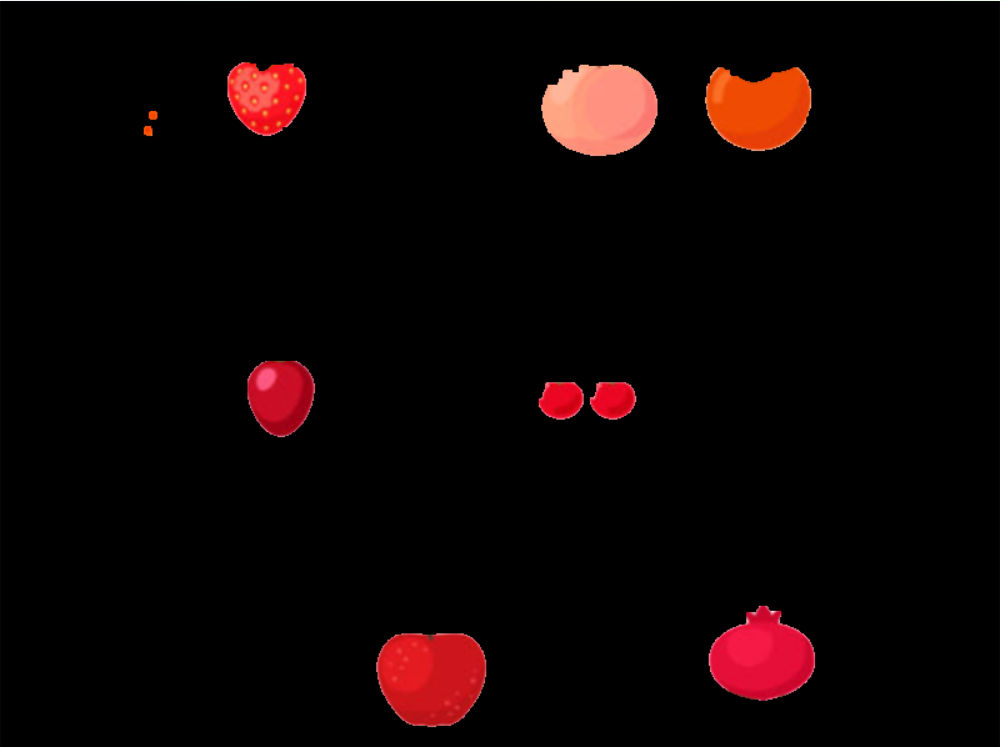

# Segmentación de Frutas usando Máscara HSV

**Alumno:** Arles Aguilar Eguiza  
**Grupo:** B  
**Materia:** Graficación  
**Fecha:** Enero - Junio 2026

---

## Objetivo
El objetivo principal de esta práctica es aplicar el modelo de color HSV para segmentar objetos específicos en una imagen digital. Se busca analizar los resultados trabajando directamente sobre una máscara binaria, identificar y contar regiones conectadas (frutas) sin depender de validaciones visuales en la imagen original, y evaluar cómo el rango de color seleccionado impacta en la calidad de la segmentación.

## Material
* **Imagen de entrada:** `(img/frutas.png)`
* **Software:** Python con librerías OpenCV y NumPy.
* **Entorno:** Script de procesamiento para conversión HSV, operaciones morfológicas y etiquetado de regiones.

## Contexto
El análisis se realiza exclusivamente sobre la máscara binaria generada tras la conversión a HSV. Siguiendo las restricciones de la práctica, **no se dibujaron contornos ni rectángulos en la imagen original**. Todo el conteo y validación se basó en las propiedades matemáticas de las regiones conectadas en la máscara procesada.

---

## Actividad 1: Exploración del Espacio HSV

Para esta actividad, seleccioné el color **Rojo** para explorar los límites del modelo HSV. Ajusté los valores de Matiz (Hue), Saturación y Valor mediante barras deslizantes hasta aislar las frutas de este color.

### Capturas del Proceso

| Etapa | Imagen |
| :--- | :--- |
| **Imagen Original** |  |
| **Conversión a HSV** |  |
| **Máscara Binaria** |  |

**Reflexión:**

* **¿Qué ocurre cuando el rango es muy estrecho?**
    Observé que si el rango de *Saturación* o *Valor* es demasiado estricto, la máscara pierde información interna de la fruta. Aparecen "agujeros" negros dentro del objeto, especialmente en las zonas donde hay brillos (reflejos de luz) o sombras propias de la fruta.
* **¿Qué ocurre cuando el rango es muy amplio?**
    Al abrir demasiado el rango, especialmente en el canal *Hue* (Matiz), la máscara comienza a incluir píxeles del fondo y de otras frutas adyacentes (como las naranjas o partes de las amarillas). Esto genera una segmentación sucia con falsos positivos.

---

## Actividad 2: Limpieza de Ruido

Antes de contar las frutas, analicé la calidad de la máscara binaria obtenida.

**Comparación visual:**

| Máscara Cruda (Sin procesar) | Máscara Limpia (Morfología) |
| :---: | :---: |
|  |  |

**Análisis:**

* **¿Qué tipo de ruido aparece?**
    Aparece ruido tipo "sal y pimienta": pequeños píxeles blancos aislados en el fondo negro y pequeños huecos negros dentro de las frutas blancas.
* **¿Por qué es necesario eliminarlo antes del conteo?**
    Es indispensable usar operaciones de *Apertura* y *Cierre* porque el algoritmo de conteo (`connectedComponents`) interpreta cada píxel blanco aislado como un objeto independiente. Sin la limpieza, el programa reportaría cientos de "frutas" que en realidad son solo polvo digital o imperfecciones de la imagen.

---

## Actividad 3: Conteo de Regiones

Utilizando el análisis de componentes conectados sobre la máscara limpia, obtuve los siguientes datos cuantitativos. Se aplicó un filtro de área mínima para descartar cualquier residuo de ruido.

**Resultados del análisis (Ejemplo con color Rojo):**

* **Número total de frutas detectadas:** 8
* **Áreas aproximadas (en píxeles):**
    * Región 1: ~14,500 px
    * Región 2: ~15,200 px
    * Región 3: ~14,800 px

*El análisis se realizó estrictamente sobre la máscara, sin validación visual en la imagen original.*

---

## Actividad 4: Comparación entre Colores

Repetí el proceso para los tres colores principales solicitados. A continuación, presento la tabla comparativa con las dificultades encontradas.

| Color | Número Detectado | Observaciones (Ruido y Dificultad) |
| :--- | :---: | :--- |
| **Rojo** | 8 | **Difícil.** El rojo en HSV atraviesa el ángulo 0, requiriendo combinar dos rangos distintos. Además, los brillos intensos (blancos) en la piel de la manzana crean huecos internos difíciles de cerrar. |
| **Verde** | 21 | **Difícil.** Aunque el rango de color es único, el programa confundía las frutas verdes con las **hojas de la piña y los tallos** de las otras frutas, ya que comparten el mismo matiz. Esto generó mucho "ruido estructural" que no era simple polvo. |
| **Amarillo** | 10 | **Medio/Fácil.** Fue el más manejable por descarte. Aunque se confunde ligeramente con el naranja, no tuvo problemas graves de brillos (como el rojo) ni interferencia de hojas (como el verde). |

**Preguntas:**

1.  **¿Qué color fue más fácil segmentar?**
    El **Amarillo**. Al comparar los tres, fue el que presentó menos conflictos externos. El rojo sufría por la iluminación (brillos) y el verde por la presencia de otros objetos naturales del mismo color (hojas y tallos), dejando al amarillo como el más estable para aislar.
2.  **¿Cuál presentó más ruido?**
    El **Verde**. A diferencia del ruido aleatorio (puntitos), el verde presentó ruido de objetos reales: las hojas y tallos. Este tipo de "ruido" es más difícil de eliminar porque son regiones grandes y conectadas, lo que obligó a ser muy estricto con el filtro de área mínima.
3.  **¿Por qué?**
    Porque la segmentación por color HSV se basa únicamente en la crominancia. Para el algoritmo, una hoja verde y una pera verde son matemáticamente idénticas en el canal H (Matiz). Al no analizar formas ni texturas, el programa no puede distinguir entre "fruta" y "planta" si ambos tienen el mismo color.

---

## Actividad 5: Análisis Crítico

**1. ¿Por qué HSV es más adecuado que RGB para esta tarea?**
En RGB, el color y la iluminación están correlacionados; una sombra cambia los valores de R, G y B simultáneamente. En HSV, la información cromática (H) está separada de la intensidad luminosa (V). Esto permite segmentar un objeto por su color independientemente de si está en sombra o iluminado, lo cual es mucho más robusto para visión artificial.

**2. ¿Cómo afecta la iluminación al canal V?**
La iluminación impacta directamente al canal V (Valor). Zonas muy iluminadas tendrán valores de V cercanos a 255, y zonas oscuras cercanos a 0. Si el rango de segmentación no contempla esta variación de V, perderemos partes de la fruta que estén sombreadas.

**3. ¿Qué sucede si dos frutas tienen tonos similares?**
Si dos frutas tienen valores de Matiz (H) similares y están físicamente en contacto, la máscara binaria las fusionará en una sola región blanca. El algoritmo de conteo las detectará como **un solo objeto** con un área grande, fallando en el conteo individual a menos que se apliquen algoritmos de separación más avanzados (como Watershed).

**4. ¿Qué limitaciones tiene la segmentación por color?**
La segmentación por color es ciega a la forma y textura. Como vimos en el caso del verde, no puede distinguir entre una fruta y una hoja. Además, depende totalmente de la calidad de la luz; en condiciones de oscuridad extrema o sobreexposición, la información de color se pierde y el método falla.

---

## Conclusión Final

La realización de esta práctica evidenció la superioridad del modelo de color HSV sobre el RGB para tareas de segmentación, pero también dejó claras sus limitaciones. A través de la experimentación, comprobé que aislar el componente de Matiz (Hue) es efectivo, pero no infalible.

Los casos del **Rojo** y el **Verde** fueron particularmente ilustrativos. Con el rojo, aprendí que la luz blanca (brillos especulares) destruye la información de color, creando huecos en la detección. Con el verde, me enfrenté al problema de la **semántica de la imagen**: el algoritmo detectó exitosamente el color verde, pero fue incapaz de distinguir que parte de ese verde eran hojas y tallos, no frutas. Esto demuestra que el color por sí solo a menudo es insuficiente para una comprensión completa de la escena.

Finalmente, el uso de la **morfología matemática** y el análisis de **regiones conectadas** fue la clave para mitigar estos errores. Sin la limpieza de ruido y el filtrado por área (para ignorar los tallos pequeños), el conteo habría sido totalmente erróneo. Esta práctica subraya que un sistema de visión artificial robusto no depende de un solo algoritmo mágico, sino de una cadena de procesos (Preprocesamiento -> Segmentación -> Limpieza -> Análisis) diseñada para compensar las debilidades de cada etapa individual.