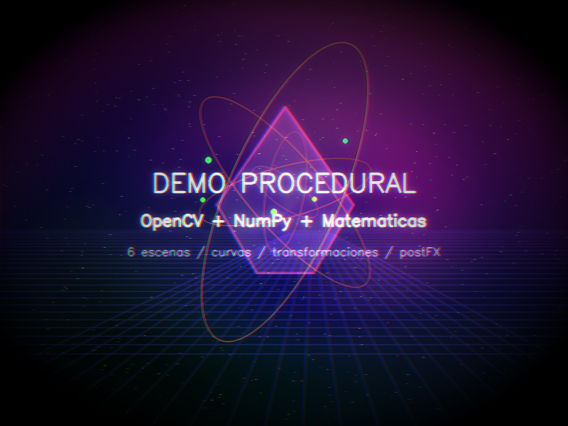
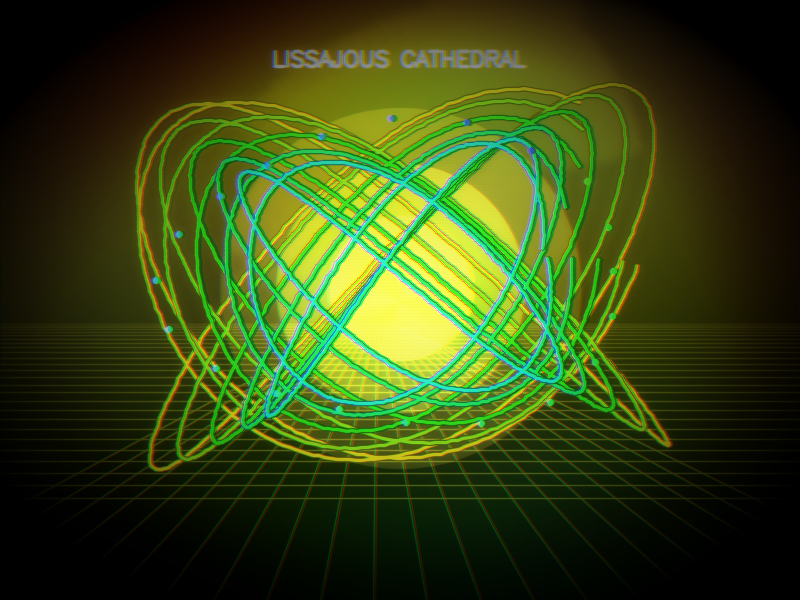
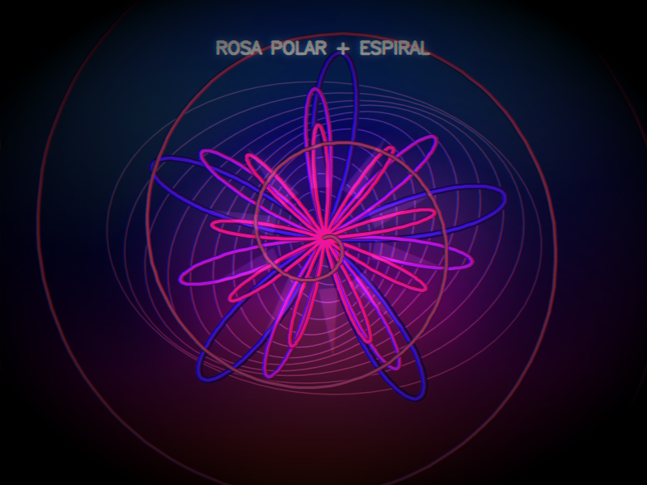
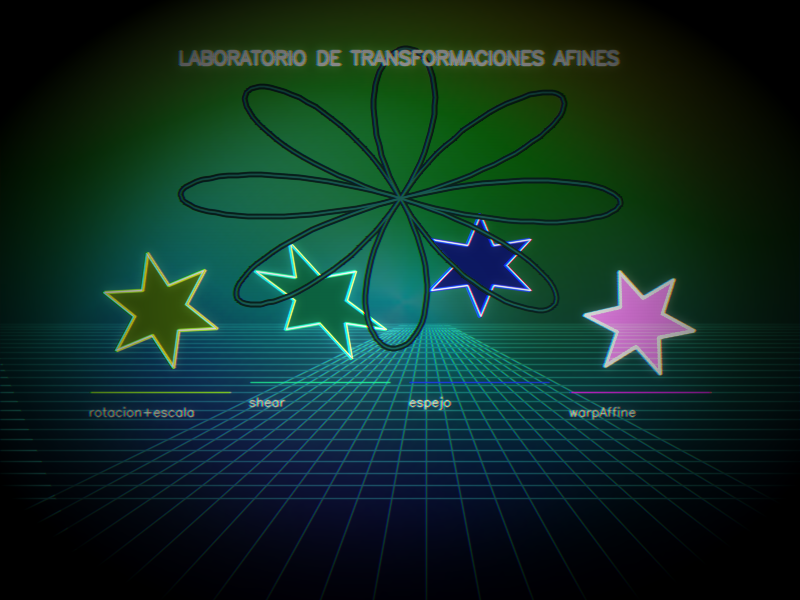
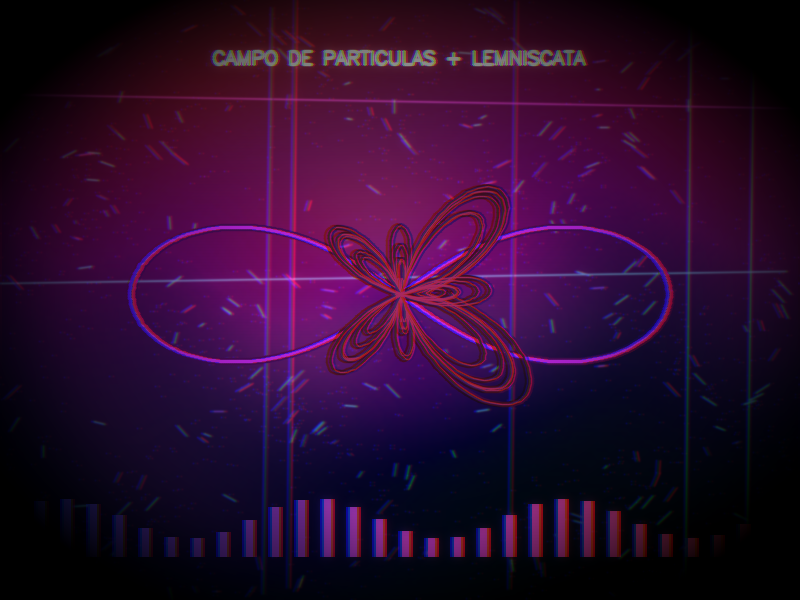
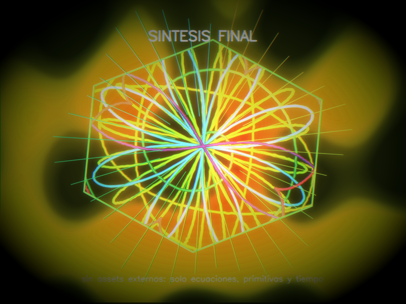
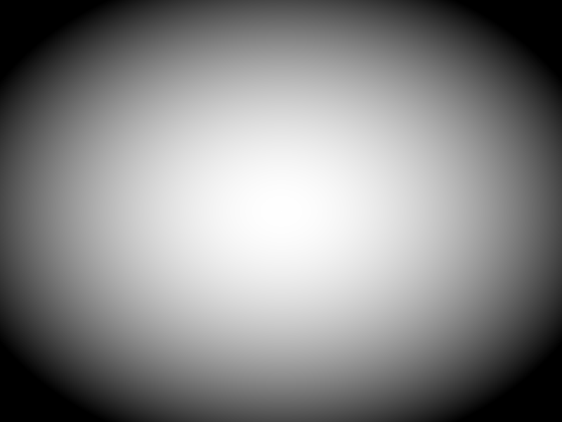
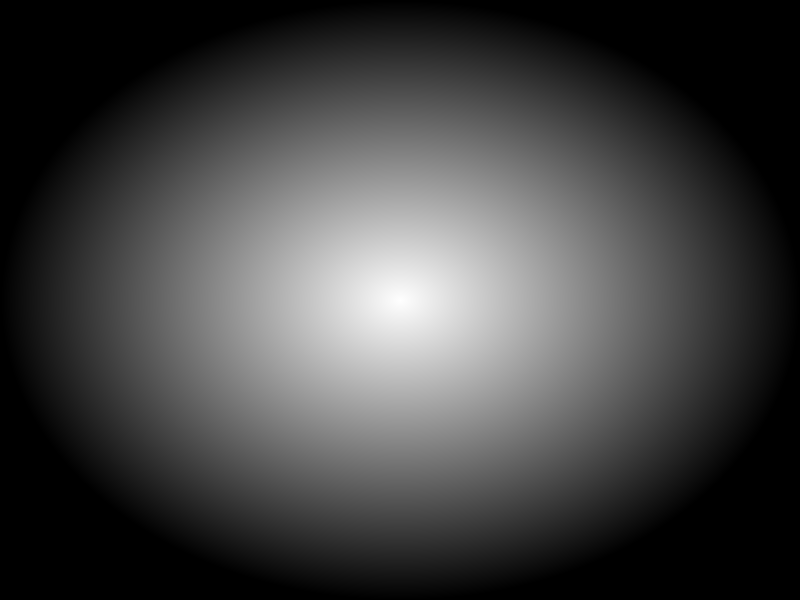
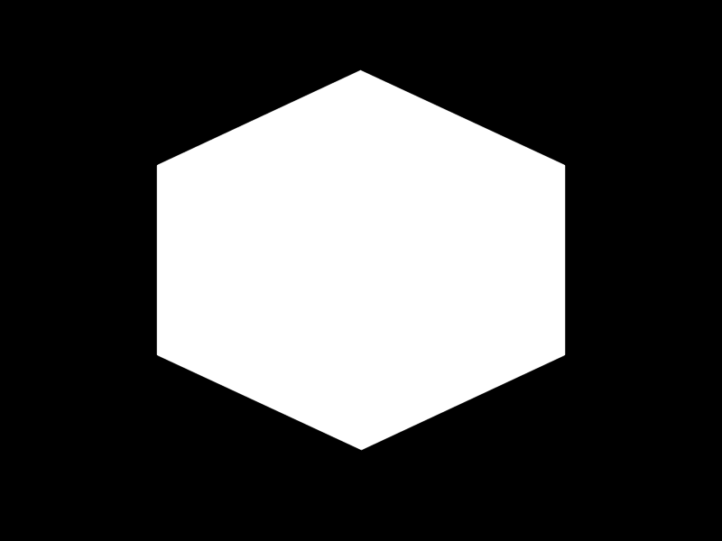

# Proyecto Final — Demo Procedural Magistral con OpenCV

## Portada

**Nombre completo:** Arles Aguilar  
**Grupo:** B  
**Práctica:** Demo procedural de graficación con Python, NumPy y OpenCV  
**Resolución:** 800 × 600  
**FPS objetivo:** 30 FPS  
**Duración del video incluido:** 30 segundos  
**Archivo principal:** `demo.py`

---

## Objetivo de la práctica

Construir un demo procedural de graficación en tiempo real usando únicamente matemáticas, algoritmos y primitivas de OpenCV. El resultado debe demostrar una línea de tiempo animada, mínimo 6 escenas, curvas paramétricas, transformaciones geométricas, composición por capas, máscaras, primitivas visibles y al menos un filtro/postproceso.

Este proyecto no utiliza imágenes externas, texturas descargadas, sprites ni modelos importados. Todo lo visual se genera por código.

---

## Cómo correr el proyecto

### 1. Instalar dependencias

```bash
pip install -r requirements.txt
```

También funciona instalando directamente:

```bash
pip install numpy opencv-python
```

### 2. Ejecutar el demo en ventana

```bash
python demo.py --preview
```

Presiona **ESC** para salir.

### 3. Generar video y capturas

```bash
python demo.py
```

Por defecto genera:

- `renders/final_demo.mp4`
- 6 capturas de escena en `renders/`
- 4 capturas de máscaras/postFX en `renders/`

### 4. Exportar video manualmente

```bash
python demo.py --export-video --out renders/final_demo.mp4 --duration 30 --fps 30
```

El exportador usa FFmpeg si está disponible para acelerar el guardado del `.mp4`; si no lo encuentra, usa `cv2.VideoWriter`.

Para un render más suave, se puede subir el muestreo interno:

```bash
python demo.py --export-video --render-fps 5
```

---

## Archivos entregados

```text
demo_procedural_magistral/
├── demo.py
├── README.md
├── requirements.txt
└── renders/
    ├── final_demo.mp4
    ├── 01_intro_observatorio.png
    ├── 02_lissajous_cathedral.png
    ├── 03_rose_spiral_mandala.png
    ├── 04_transform_lab.png
    ├── 05_vector_field.png
    ├── 06_final_synthesis.png
    ├── mask_01_vignette.png
    ├── mask_02_radial_composite.png
    ├── mask_03_hexagonal_final.png
    └── mask_04_scanlines.png
```

---

## Línea de tiempo y escenas

| Tiempo | Escena | Nombre | Qué demuestra |
|---:|---:|---|---|
| 0–5 s | 1 | Observatorio procedural | Créditos, estrellas, grid, elipses orbitales, fade-in |
| 5–10 s | 2 | Lissajous Cathedral | Curvas Lissajous, rotación, escala, composición luminosa |
| 10–15 s | 3 | Rosa polar + espiral | Rosa polar, espiral de Arquímedes, máscaras radiales, `fillPoly` |
| 15–20 s | 4 | Laboratorio de transformaciones | Rotación, escala, shear, espejo, traslación y `warpAffine` |
| 20–25 s | 5 | Campo de partículas | Movimiento por funciones trigonométricas, lemniscata, curva mariposa |
| 25–30 s | 6 | Síntesis final | Composición de 6 curvas, máscara hexagonal, fuego/calor procedural |

Las transiciones se hacen por timeline y crossfade/glitch, no por clicks ni input del usuario.

---

## Capturas por escena

### Escena 1 — Observatorio procedural



### Escena 2 — Lissajous Cathedral



### Escena 3 — Rosa polar + espiral



### Escena 4 — Laboratorio de transformaciones



### Escena 5 — Campo de partículas



### Escena 6 — Síntesis final



---

## Capturas de pantalla de las máscaras generadas

### Máscara 1 — Viñeta



### Máscara 2 — Composición radial



### Máscara 3 — Máscara hexagonal final



### Máscara 4 — Scanlines


---

## Curvas paramétricas usadas

El demo usa más de 6 curvas paramétricas distintas, dibujadas con `cv2.polylines`.

### 1. Lissajous

\[
x(t)=\sin(a t+\delta), \quad y(t)=\sin(b t)
\]

Se usa en la escena 2 para crear una figura central que cambia con el tiempo. Los parámetros `a`, `b` y `delta` se animan con funciones seno/coseno.

### 2. Rosa polar

\[
r(\theta)=\cos(k\theta)
\]

Convertida a coordenadas cartesianas:

\[
x(\theta)=r(\theta)\cos(\theta), \quad y(\theta)=r(\theta)\sin(\theta)
\]

Se usa en la escena 3 y en la síntesis final para generar mandalas.

### 3. Espiral de Arquímedes

\[
r(\theta)=a+b\theta
\]

\[
x(\theta)=r(\theta)\cos(\theta), \quad y(\theta)=r(\theta)\sin(\theta)
\]

Aparece en la escena 3 como curva secundaria de profundidad.

### 4. Hipotrocoide / Spirograph

\[
x(t)=(R-r)\cos(t)+d\cos\left(\frac{R-r}{r}t\right)
\]

\[
y(t)=(R-r)\sin(t)-d\sin\left(\frac{R-r}{r}t\right)
\]

Se usa en la escena 4 y en la composición final.

### 5. Lemniscata de Bernoulli

\[
x(t)=\frac{\sqrt{2}\cos(t)}{\sin^2(t)+1}
\]

\[
y(t)=\frac{\sqrt{2}\cos(t)\sin(t)}{\sin^2(t)+1}
\]

Se usa en la escena 5 como curva protagonista sobre el campo de partículas.

### 6. Curva mariposa

\[
x(t)=\sin(t)\left(e^{\cos(t)}-2\cos(4t)-\sin^5\left(\frac{t}{12}\right)\right)
\]

\[
y(t)=\cos(t)\left(e^{\cos(t)}-2\cos(4t)-\sin^5\left(\frac{t}{12}\right)\right)
\]

Se usa en la escena 5 como forma orgánica adicional.

### 7. Epicicloide

\[
x(t)=(R+r)\cos(t)-r\cos\left(\frac{R+r}{r}t\right)
\]

\[
y(t)=(R+r)\sin(t)-r\sin\left(\frac{R+r}{r}t\right)
\]

Aparece en la síntesis final como una de las capas curvas.

---

## Transformaciones implementadas

| Transformación | Dónde aparece | Cómo se aplicó |
|---|---|---|
| Rotación | Escenas 2, 4 y 6 | `cv2.getRotationMatrix2D` y transformación de puntos |
| Escala | Escena 4 | Matriz afín 2×3 con escala animada |
| Traslación | Escena 4 | Se modifica la columna de traslación de la matriz 2×3 |
| Shear | Escena 4 | Matriz afín manual `[[1, sh, -sh*cy], [0, 1, 0]]` |
| Espejo | Escena 4 | Matriz con escala negativa en X |
| `warpAffine` | Escena 4 | Figura dibujada en una capa y deformada con `cv2.warpAffine` |
| Composición por capas | Escenas 3, 4 y 6 | `cv2.addWeighted`, máscaras y buffers temporales |

---

## Primitivas visibles de OpenCV

| Primitiva | Uso |
|---|---|
| `cv2.line` | Grid, rayos, partículas con dirección |
| `cv2.circle` | Estrellas, nodos, soles/glow geométrico |
| `cv2.ellipse` | Órbitas, anillos y geometría del observatorio |
| `cv2.fillPoly` | Prisma central, pétalos, estrella transformada, máscara hexagonal |
| `cv2.polylines` | Todas las curvas paramétricas principales |
| `cv2.putText` | Créditos, títulos de escenas y etiquetas |

---

## Filtros y postproceso

| PostFX | Archivo / función | Propósito |
|---|---|---|
| Bloom | `post_bloom` | Resalta trazos brillantes y curvas |
| Viñeta | `post_vignette` | Dirige la vista al centro |
| Scanlines | `post_scanlines` | Da estética de demo/monitor |
| Aberración cromática | `post_chromatic_aberration` | Separa canales para un look digital |
| Glitch de transición | `transition_glitch` | Marca cambios de escena |
| Posterización opcional | `post_posterize` | Reduce niveles de color si se quiere look retro |

---

## Tabla comparativa de resultados

| Criterio | Requisito | Resultado en este proyecto |
|---|---|---|
| Resolución | 800×600 | Cumplido |
| FPS objetivo | 30 FPS | MP4 incluido a 30 FPS |
| Duración | 30–60 segundos | 30 segundos |
| Lenguaje | Python 3 | Cumplido |
| Librerías | NumPy + OpenCV | Cumplido |
| Assets externos | Prohibidos | No se usan |
| Escenas | Mínimo 6 | 6 escenas |
| Curvas | Mínimo 6 | 7 curvas documentadas |
| Transformaciones | Mínimo 2 | Rotación, escala, traslación, shear, espejo, warpAffine |
| Primitivas | Uso visible | line, circle, ellipse, fillPoly, polylines, putText |
| PostFX | Mínimo 1 | Bloom, viñeta, scanlines, aberración y glitch |
| Export final | MP4 o frames | `renders/final_demo.mp4` |
| Capturas | 1 por escena | 6 capturas |
| Máscaras | Capturas requeridas | 4 máscaras generadas |

---

## Respuestas a preguntas de análisis

### 1. ¿Por qué se considera procedural?

Porque las imágenes no provienen de archivos externos. Cada escena se construye en tiempo real con ecuaciones, ruido determinista, primitivas de OpenCV, curvas paramétricas, máscaras y operaciones de composición.

### 2. ¿Cómo avanza el demo?

El demo avanza por una línea de tiempo. La función `render_timeline(t, state, buf_a, buf_b)` decide qué escena corresponde según el tiempo `t`, aplica transiciones y devuelve el frame final. No requiere clicks ni entrada del usuario.

### 3. ¿Dónde se nota el uso de transformaciones?

Principalmente en la escena 4, donde una misma figura base pasa por rotación, escala, shear, espejo y `warpAffine`. También se transforman curvas en escenas 2 y 6 usando matrices afines.

### 4. ¿Qué aportan las máscaras?

Las máscaras permiten limitar visualmente capas y postprocesos. En el proyecto aparecen una viñeta, una máscara radial, una máscara hexagonal y un patrón de scanlines. Esto ayuda a componer varias capas sin que todo se mezcle de forma plana.

### 5. ¿Qué filtro/postFX fue más importante?

La viñeta y el bloom son los más importantes visualmente. La viñeta concentra la atención en el centro y el bloom hace que las curvas parezcan luminosas. El glitch se usa para que las transiciones sean más notorias.

### 6. ¿Qué parte del temario se muestra con más claridad?

Las curvas paramétricas y las transformaciones afines. El demo incluye varias familias de curvas y una escena completa dedicada a matrices 2×3, deformación y composición.

---

## Conclusión final

El proyecto cumple los requisitos de la práctica y eleva el ejemplo base a una entrega completa: seis escenas diferenciadas, más de seis curvas paramétricas, transformaciones afines visibles, composición por capas, máscaras y postprocesos. La propuesta mantiene una estética coherente de observatorio digital/demogroup y demuestra que un mundo visual completo puede construirse únicamente con matemáticas, tiempo y primitivas de OpenCV.

